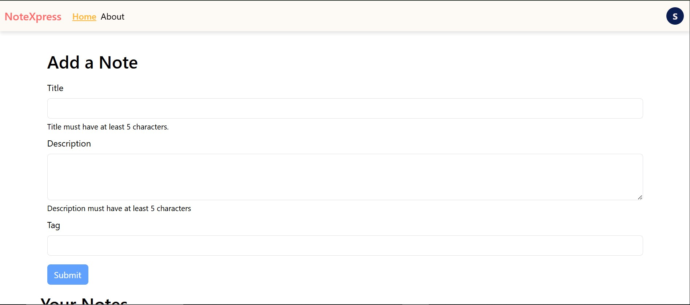
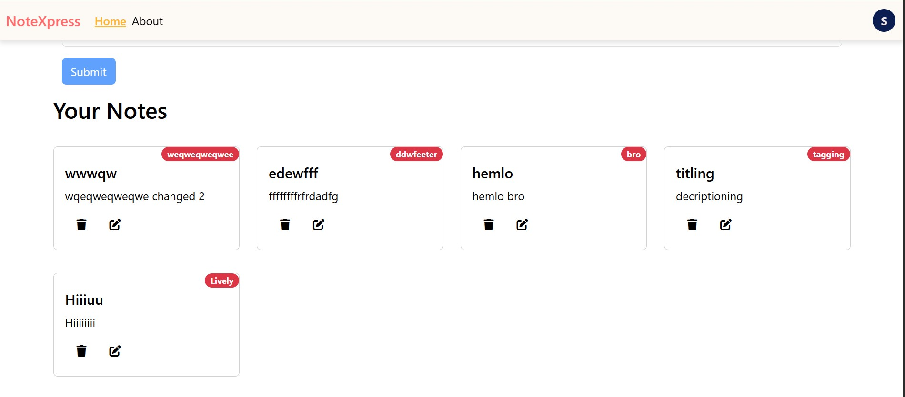
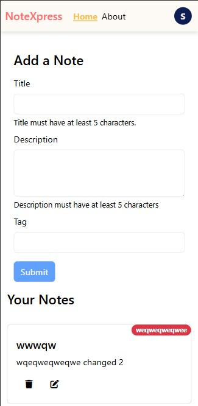
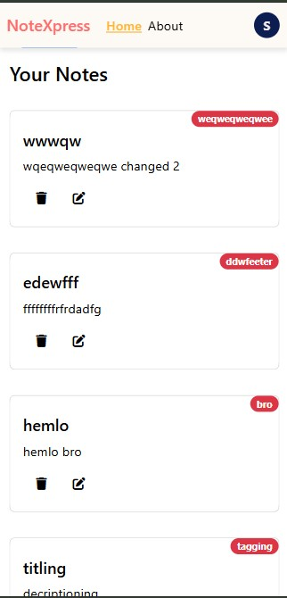
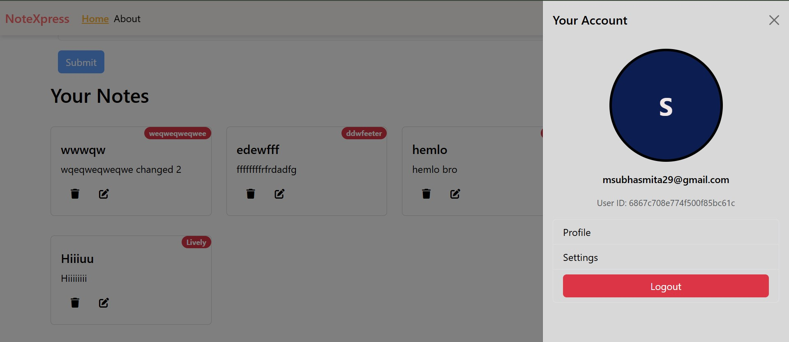
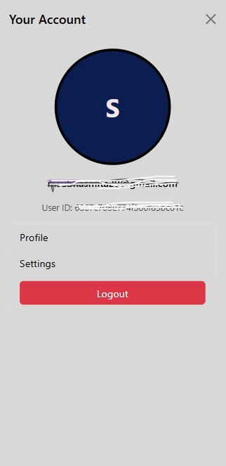
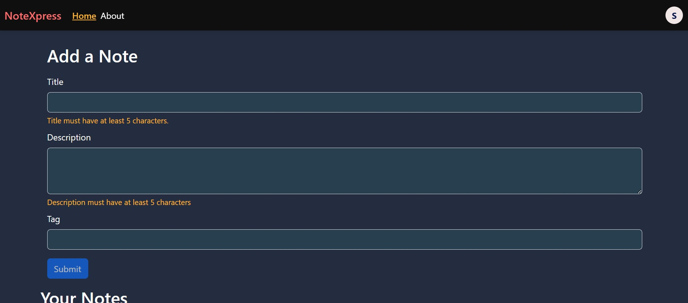

## Demo
You can try the live version here: [notexpress.live](https://inotebook-save-your-notes.onrender.com/)

# Title Of The Project
NoteXpress

# Why Ths Title
The app is named "notexpress" as a creative blend of the words "notes" and "express". It reflects that this app is built for managing notes quickly and efficiently, and also hints at the use of Express.js on the backend.

# About This Project
In a world full of ideas, tasks, and to-dos, NoteXpress helps you keep everything organized and accessible, all in one place.

# Applications of the Project
Create Notes – Write, edit, and delete your thoughts or reminders easily.
        > Organize Efficiently – Manage notes effortlessly with a clean and intuitive interface.
        > Switch Themes – Choose between light and dark modes for a better visual experience.
        > Secure Access – Your notes are safe and private with token-based authentication.
        > Responsive Design – Enjoy a smooth experience across all screen sizes.

# Built With
> React.js for a responsive frontend
> Node.js and Express for a powerful backend
> MongoDB for flexible data storage
> Bootstrap for beautiful UI components

# No clutter. No distractions. Just your ideas – organized and always accessible.

# Screenshots

#### Homepage (Desktop View)

#### Homepage (Mobile View)

#### Viewing user profile (Desktop and Mobile View)

#### Edit your Note

#### Dark mode

# 🔧 Tech Stack

- **Frontend:** React.js, Bootstrap
- **Backend:** Node.js, Express.js
- **Database:** MongoDB
- **Authentication:** JWT

## Demo
You can try the live version here: [notexpress.live](https://inotebook-save-your-notes.onrender.com/)
